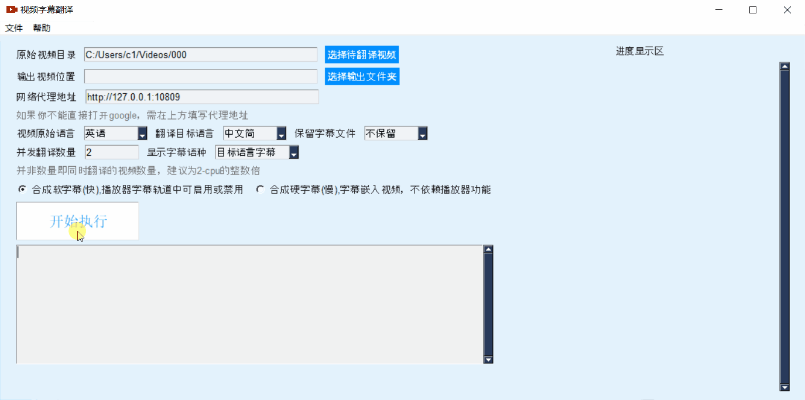
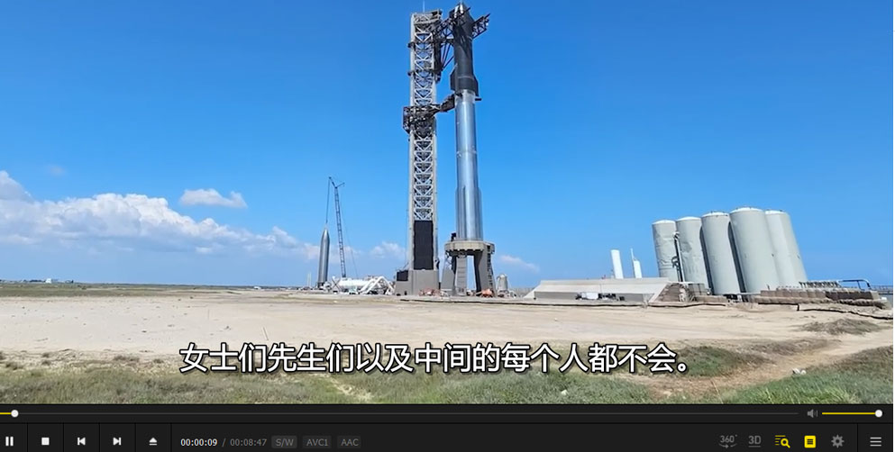
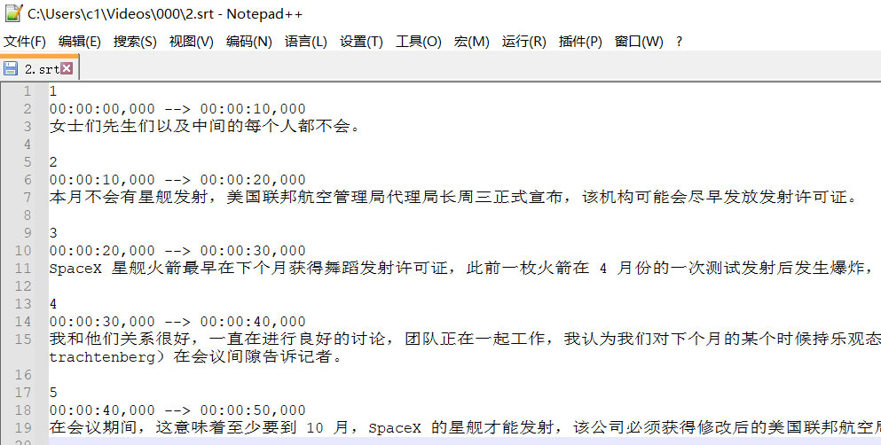

# 使用方法

1. 从 release中下载最新版，解压，双击 sp.exe
2. 创建一个文件夹，里面存放 mp4视频(mkv,avi,mpg),从软件界面“原始视频目录”中选择该文件夹；“输出视频目录”如果不选择，则默认生成在同目录下的“_video_out”
3. 如果你所在地区无法直接访问google，需要在软件界面“网络连接代理”中设置代理，比如若使用 v2ray ，则填写 http://127.0.0.1:10809,若clash，则填写 http://127.0.0.1:7890. 如果你修改了默认端口或使用的其他代理软件，则按需填写
4. 根据你的电脑性能，可修改“并发翻译数量”，即同时执行翻译的视频任务。
5. “显示字幕语种”：如果选择“双字幕”，那么在视频中将会以上层源语言、下层目标语言显示2个字幕
6. “保留字幕文件”：如果选择“是”，那么下次执行时，如果存在字幕文件，将直接使用，会导致上方第5条切换不生效，除非手动删除字幕文件
7. 点击“开始执行”，会先检测能否连接google服务，若可以，则正式执行，右侧会显示当前进度，底部白色文本框内显示详细日志
8. 建议统一使用mp4格式，处理速度快，网络兼容性好
9. 软合成字幕：字幕作为单独文件嵌入视频，可再次提取出，如果播放器支持，可在播放器字幕管理中启用或禁用字幕；
   硬合成字幕：字幕直接嵌入视频内容，不可再次提取，不依赖播放器，均可显示字幕。
10. 默认会在“原始视频目录”下生成同名的字幕文件“视频名.srt”

# 源码部署方式

1. 电脑安装好 python 3.9+
2. `git clone https://github.com/jianchang512/pyvideotrans`
3. `cd pyvideotrans`
4. `pip install -r requirements.txt`
5. 解压 ffmpeg.zip 到根目录下
6. `python sp.py`
7. 本地打包 ` pyinstaller -w sp.py`

# 截图

# 特殊处理

> 在使用httpx和 googletrans 配置代理时可能报错，将 googletrans 包下 client.py 57 行左右改为 `proxies 类型 改为 httpcore.SyncHTTPProxy`

# 鸣谢

> 本程序依赖这些开源项目

1. pydub
2. ffmpeg
3. pysimpleGUI
4. googletrans
5. httpx
6. SpeechRecognition

