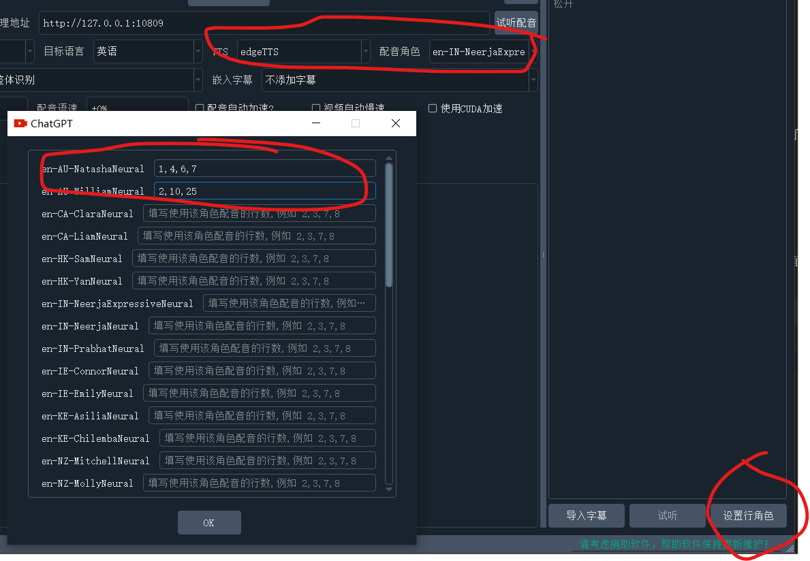

[English Readme](./README_EN.md)  /  [👑捐助该项目](./about.md) / [加入Discord](https://discord.gg/TMCM2PfHzQ) / [Q群 902124277](https://qm.qq.com/cgi-bin/qm/qr?k=9VNSiJyInxyQ3HK3vmOTibo8pzcDekju&jump_from=webapi&authKey=xcW1+7N1E4SM+DXqyl5d61UOtNooA1C9WR5A/yfA0fmfyUDRRSZex1WD0l+9x1kO) 

# 视频翻译和配音工具

[windows预编译版exe下载地址](https://github.com/jianchang512/pyvideotrans/releases)

>
> 这是一个视频翻译配音工具，可将一种语言的视频翻译为另一种语言配音和字幕的视频。
>
> 语音识别基于 `faster-whisper` 离线模型.
>
> 文字翻译支持 `google|baidu|tencent|chatGPT|Azure|Gemini|DeepL|DeepLX` ，
>
> 文字合成语音支持 `Microsoft Edge tts` `Openai TTS-1` `Elevenlabs TTS`
>

# 主要用途和使用方式

【翻译视频并配音】根据需要设置各个选项，自由配置组合，实现翻译和配音、自动加减速、合并等

【提取字幕不翻译】选择视频文件，选择视频源语言，则从视频识别出文字并自动导出字幕文件到目标文件夹

【提取字幕并翻译】选择视频文件，选择视频源语言，设置想翻译到的目标语言，则从视频识别出文字并翻译为目标语言，然后导出双语字幕文件到目标文件夹

【字幕和视频合并】选择视频，然后将已有的字幕文件拖拽到右侧字幕区，将源语言和目标语言都设为字幕所用语言、然后选择配音类型和角色，开始执行

【为字幕创建配音】将本地的字幕文件拖拽到右侧字幕编辑器，然后选择目标语言、配音类型和角色，将生成配音后的音频文件到目标文件夹

【音视频识别文字】将视频或音频拖拽到识别窗口，将识别出文字并导出为srt字幕格式

【将文字合成语音】将一段文字或者字幕，使用指定的配音角色生成配音

【从视频分离音频】将视频文件分离为音频文件和无声视频

【音视频字幕合并】音频文件、视频文件、字幕文件合并为一个视频文件

【音视频格式转换】各种格式之间的相互转换

【文字字幕翻译】将文字或srt字幕文件翻译为其他语言

----


https://github.com/jianchang512/pyvideotrans/assets/3378335/c3d193c8-f680-45e2-8019-3069aeb66e01


# 使用win预编译exe版本(其他系统使用源码部署)

0. [点击下载去下载预编译版](https://github.com/jianchang512/pyvideotrans/releases)

1. 建议解压到英文路径下，并且路径中不含有空格。解压后双击 sp.exe(若遇到权限问题可右键使用管理员权限打开)

3. 未做免杀，国产杀软可能误报，可忽略或使用源码部署


# 源码部署

1. 配置好 python 3.9->3.11 环境
2. `git clone https://github.com/jianchang512/pyvideotrans`
3. `cd pyvideotrans`
4. `python -m venv venv`
5. win下执行 `%cd%/venv/scripts/activate`,linux和mac执行 `source ./venv/bin/activate`
6. `pip install -r requirements.txt`，如果遇到版本冲突报错，请使用 `pip install -r requirements.txt --no-deps` （MacOS不支持CUDA，Mac下将 requirements.txt 替换为 requirements-mac.txt ）
7. win下解压 ffmpeg.zip 到根目录下 (ffmpeg.exe文件)，linux和mac 请自行安装 ffmpeg，具体方法可"百度 or Goole"
8. `python sp.py` 打开软件界面
9. 如果需要支持CUDA加速，需要设备具有 NVIDIA 显卡，具体安装防范见下方 [CUDA加速支持](https://github.com/jianchang512/pyvideotrans?tab=readme-ov-file#cuda-%E5%8A%A0%E9%80%9F%E6%94%AF%E6%8C%81)


# 使用方法

1. 原始视频：选择mp4/avi/mov/mkv/mpeg视频,可选择多个视频；

2. 输出视频目录：如果不选择，则默认生成在同目录下的 `_video_out`，同时在该目录下的srt文件夹中将创建原语言和目标语言的两种字幕文件

3. 选择翻译：可选 google|baidu|tencent|chatGPT|Azure|Gemini|DeepL|DeepLX 翻译渠道

4. 网络代理地址：如果你所在地区无法直接访问 google/chatGPT，需要在软件界面 网络代理 中设置代理，比如若使用 v2ray ，则填写 `http://127.0.0.1:10809`,若clash，则填写 `http://127.0.0.1:7890`. 如果你修改了默认端口或使用的其他代理软件，则按需填写

5. 视频原始语言：选择待翻译视频里的语言种类

6. 翻译目标语言：选择希望翻译到的语言种类

7. 选择配音：选择翻译目标语言后，可从配音选项中，选择配音角色；
   
   硬字幕: 是指始终显示字幕，不可隐藏，如果希望网页中播放时也有字幕，请选择硬字幕嵌入

   软字幕: 如果播放器支持字幕管理，可显示或者隐藏字幕，该方式网页中播放时不会显示字幕，某些国产播放器可能不支持,需要将生成的视频同名srt文件和视频放在一个目录下才会显示


8. 语音识别模型: 选择 base/small/medium/large-v3, 识别效果越来越好，但识别速度越来越慢，所需内存越来越大，内置base模型，其他模型请单独下载后，解压放到 `当前软件目录/models`目录下.如果GPU显存低于4G，不要使用 large-v3

   整体识别/预先分割: 整体识别是指直接发送整个语音文件给模型，由模型进行处理，分割可能更精确，但也可能造出30s长度的单字幕，适合有明确静音的音频;  预先分割时指先将音频按10s左右长度切割后再分别发送给模型处理。

    [全部模型下载地址](https://github.com/jianchang512/stt/releases/tag/0.0)
    
    下载后解压，将压缩包内的"models--Systran--faster-whisper-xx"文件夹复制到models目录内，解压复制后 models 目录下文件夹列表如下

    
 
    [VLC解码器下载](https://www.videolan.org/vlc/)

    [FFmepg下载(编译版已自带)](https://www.ffmpeg.org/)

9. 配音语速：填写 -90到+90 之间的数字，同样一句话在不同语言语音下，所需时间是不同的，因此配音后可能声画字幕不同步，可以调整此处语速，负数代表降速，正数代表加速播放。

10. 音视频对齐: 分别是“配音自动加速”和“视频自动降速”

>
> 翻译后不同语言下发音时长不同，比如一句话中文3s，翻译为英文可能5s，导致时长和视频不一致。
> 
> 2种解决方式:
>
>     1. 强制配音加速播放，以便缩短配音时长和视频对齐
> 
>     2. 强制视频慢速播放，以便延长视频时长和配音对齐。
> 
> 两者只可选其一
>  
 
  
11. 静音片段: 填写100到2000的数字，代表毫秒，默认 500，即以大于等于 500ms 的静音片段为区间分割语音

12. **CUDA加速**：确认你的电脑显卡为 N卡，并且已配置好CUDA环境和驱动，则开启选择此项，速度能极大提升，具体配置方法见下方[CUDA加速支持](https://github.com/jianchang512/pyvideotrans?tab=readme-ov-file#cuda-%E5%8A%A0%E9%80%9F%E6%94%AF%E6%8C%81)

13. TTS: 可用 edgeTTS 和 openai TTS模型中选择要合成语音的角色，openai需要使用官方接口或者开通了tts-1模型的三方接口

14. 点击 开始按钮 底部会显示当前进度和日志，右侧文本框内显示字幕

15. 字幕解析完成后，将暂停等待修改字幕，如果不做任何操作，60s后将自动继续下一步。也可以在右侧字幕区编辑字幕，然后手动点击继续合成

16. 将在目标文件夹中视频同名的子目录内，分别生成两种语言的字幕srt文件、原始语音和配音后的wav文件，以方便进一步处理

17. 设置行角色：可对字幕中的每行设定发音角色，首先左侧选好TTS类型和角色，然后点击字幕区右下方“设置行角色”，在每个角色名后面文本中中，填写要使用该角色配音的行编号，如下图：
    


# CUDA 加速支持

**安装CUDA工具** [详细安装方法](https://juejin.cn/post/7318704408727519270)

安装好CUDA后，如果有问题，执行 `pip uninstall torch torchaudio torchvision` 卸载，然后去 [https://pytorch.org/get-started/locally/]() 根据你的操作系统类型和 CUDA 版本，选择命令，将 `pip3` 改为 `pip`，再复制命令去执行。
 
安装完成后执行 `python testcuda.py` 如果输出均是  True,说明可用  

有时会遇到“cublasxx.dll不存在”的错误, 或者未遇到此错误，并且CUDA配置正确，但始终出现识别错误，需要下载 cuBLAS，然后将dll文件复制到系统目录下

[点击下载 cuBLAS](https://github.com/jianchang512/stt/releases/download/0.0/cuBLAS_win.7z)，解压后将里面的dll文件复制到 C:/Windows/System32下


# 常见问题

1. 使用google翻译，提示 error

   国内使用google或chatGPT官方接口，都需要挂梯子

2. 已使用了全局代理，但看起来并没有走代理

   需要在软件界面“网络代理”中设置具体的代理地址，比如 http://127.0.0.1:7890

3. 提示 FFmepg 不存在

   首先查看确定软件根目录下存在 ffmpeg.exe, ffprobe.exe文件，如果不存在，解压 ffmpeg.7z，将这2个文件放到软件根目录下

4. windows上开启了 CUDA，但是提示错误

   A: [首先查看详细安装方法](https://juejin.cn/post/7318704408727519270)，确定你已正确安装了cuda相关工具，如果仍存在错误，[点击下载 cuBLAS](https://github.com/jianchang512/stt/releases/download/0.0/cuBLAS_win.7z)，解压后将里面的dll文件复制到 C:/Windows/System32下

   B: 若确定和A无关，那么请检查视频是否是H264编码的mp4，有些高清视频是 H265 编码的，这种不支持，可尝试在“视频工具箱”中转为H264视频

   C: GPU下对视频进行硬件解码编码对数据正确性要求严格，容错率几乎为0，任何一点错误都会导致失败，加上显卡型号、驱动版本、CUDA版本、ffmpeg版本不同版本之间的差异等，导致很容易出现兼容性错误。目前加了回退，GPU上失败后自动使用CPU软件编解码。失败时logs目录下日志里会记录出错信息。

5. 提示模型不存在

   在 0.985 版本之后，模型需要重新安装，models目录下是各个模型的文件夹，而不是pt文件。
   要使用base模型，要保证 models/models--Systran--faster-whisper-base 文件夹存在，如果不存在，需要下载后将该文件夹复制到 models下。
   要使用small模型，要保证 models/models--Systran--faster-whisper-small 文件夹存在，如果不存在，需要下载后将该文件夹复制到 models下。
   要使用medium模型，要保证 models/models--Systran--faster-whisper-medium 文件夹存在，如果不存在，需要下载后将该文件夹复制到 models下。
   要使用large-v3模型，要保证 models/models--Systran--faster-whisper-large-v3 文件夹存在，如果不存在，需要下载后将该文件夹复制到 models下。

   [全部模型下载地址](https://github.com/jianchang512/stt/releases/tag/0.0)

6. 提示目录不存在或权限错误

   在sp.exe上右键使用管理员权限打开

7. 提示错误，但没有详细出错信息

   打开logs目录，找到最新的log日志文件，拉到最底部，即可看到报错信息。

8. large-v3模型非常慢

   如果你没有N卡GPU，或者没有配置好CUDA环境，或者显存低于4G，请不要使用这个模型，否则会非常慢和卡顿

9. 提示缺少cublasxx.dll文件

   有时会遇到“cublasxx.dll不存在”的错误，此时需要下载 cuBLAS，然后将dll文件复制到系统目录下

   [点击下载 cuBLAS](https://github.com/jianchang512/stt/releases/download/0.0/cuBLAS_win.7z)，解压后将里面的dll文件复制到 C:/Windows/System32下


10. 背景音乐丢失了

   只识别人声并保存人声，即配音后音频中不会存在原背景音乐，如果你需要保留，请使用[人声背景音乐分离项目](https://github.com/jianchang512/vocal-separate)，将背景音提取出来，然后再和配音文件合并。

11. 怎样使用自定义音色
   
   目前暂不支持该功能，如果有需要，你可以先识别出字幕，然后使用另一个[声音克隆项目](https://github.com/jiangchang512/clone-voice),输入字幕srt文件，选择自定义的音色合成为音频文件，然后再生成新视频。
   
13. 字幕语音无法对齐

> 翻译后不同语言下发音时长不同，比如一句话中文3s，翻译为英文可能5s，导致时长和视频不一致。
> 
> 2种解决方式:
> 
>     1. 强制配音加速播放，以便缩短配音时长和视频对齐
> 
>     2. 强制视频慢速播放，以便延长视频时长和配音对齐。
> 
> 两者只可选其一
   

14. 字幕不显示或显示乱码

> 
> 采用软合成字幕：字幕作为单独文件嵌入视频，可再次提取出，如果播放器支持，可在播放器字幕管理中启用或禁用字幕；
> 
> 注意很多国内播放器必须将srt字幕文件和视频放在同一目录下且名字相同，才能加载软字幕，并且可能需要将srt文件转为GBK编码，否则显示乱码，
> 

15. 如何切换软件界面语言/中文or英文

软件目录下如果不存在 set.ini 文件则先创建，然后将以下代码粘贴到内，`lang=`后填写语言代码，`zh`代表中文,`en`代表英文，然后重启软件

```

[GUI]
;GUI show language ,set en or zh  eg.  lang=en
lang =

```

# CLI 命令行模式

[](https://colab.research.google.com/drive/1yDGPWRyXeZ1GWqkOpdJDv4nA_88HNm01?usp=sharing)


cli.py 是命令行执行脚本，`python cli.py` 是最简单的执行方式

接收的参数:

`-m mp4视频的绝对地址`

具体各项配置参数可在 位于 cli.py 同目录的 cli.ini 中配置，其他待处理的mp4视频地址，也可以通过命令行参数 `-m mp4视频绝对地址` 方式来配置，比如 `python cli.py -m D:/1.mp4`.

cli.ini 里是各项完整参数，第一个参数`source_mp4`即代表待处理的视频，如果命令行通过 -m 传参，则使用命令行参数，否则使用此`source_mp4`.

`-c 配置文件地址`

你也可以复制 cli.ini 到其他位置后，通过命令行上 `-c cli.ini的绝对路径地址` 来指定要使用的配置文件，比如 `python cli.py -c E:/conf/cli.ini`, 则会使用该文件里的配置信息，而忽略项目目录下的配置文件。

`-cuda`无需后跟值，只要添加即代表启用CUDA加速(如果可用) `python cli.py -cuda`

示例:`python cli.py -cuda -m D:/1.mp4`

## cli.ini内具体参数和说明

```
;命令行参数
;待处理的视频绝对地址，正斜杠做路径分隔符，也可在命令行参数中 -m 后传递
source_mp4=
;网络代理地址，google  chatGPT官方china必填
proxy=http://127.0.0.1:10809
;输出结果文件到目录
target_dir=
;视频发音语言，从这里选择 zh-cn zh-tw en fr de ja ko ru es th it pt vi ar tr
source_language=zh-cn
;语音识别语言 无需填写
detect_language=
;翻译到的语言 zh-cn zh-tw en fr de ja ko ru es th it pt vi ar tr
target_language=en
;软字幕嵌入时的语言，不填写
subtitle_language=
;true=启用CUDA
cuda=false
;角色名称，openaiTTS角色名称“alloy,echo,fable,onyx,nova,shimmer”，edgeTTS角色名称从 voice_list.json 中对应语言的角色中寻找。elevenlabsTTS 的角色名称从 elevenlabs.json 中寻找
voice_role=en-CA-ClaraNeural
; 配音加速值，必须以 + 号或 - 号开头，+代表加速，-代表减速，以%结尾
voice_rate=+0%
;可选 edgetTTS  openaiTTS elevenlabsTTS
tts_type=edgeTTS
;静音片段，单位ms
voice_silence=500
;all=整体识别，split=预先分割声音片段后识别
whisper_type=all
;语音识别模型可选，base small medium large-v3
whisper_model=base
;翻译渠道，可选 google baidu  chatGPT Azure  Gemini  tencent DeepL DeepLX
translate_type=google
;0=不嵌入字幕，1=嵌入硬字幕，2=嵌入软字幕
subtitle_type=1
;true=配音自动加速
voice_autorate=false
;true=视频自动慢速
video_autorate=false
;deepl翻译的接口地址
deepl_authkey=asdgasg
;自己配置的deeplx服务的接口地址
deeplx_address=http://127.0.0.1:1188
;腾讯翻译id
tencent_SecretId=
;腾讯翻译key
tencent_SecretKey=
;百度翻译id
baidu_appid=
;百度翻译密钥
baidu_miyue=
; elevenlabstts的key
elevenlabstts_key=
;chatGPT 接口地址，以 /v1 结尾，可填写第三方接口地址
chatgpt_api=
;chatGPT的key
chatgpt_key=
;chatGPT模型，可选 gpt-3.5-turbo gpt-4
chatgpt_model=gpt-3.5-turbo
; Azure 的api接口地址
azure_api=
;Azure的key
azure_key=
; Azure的模型名，可选 gpt-3.5-turbo gpt-4
azure_model=gpt-3.5-turbo
;google Gemini 的key
gemini_key=

```

# 软件预览截图


[Youtube demo](https://youtu.be/-S7jptiDdtc)

# 视频教程(第三方)

[Mac下源码部署/b站](https://b23.tv/RFiTmlA)

[用Gemini Api给视频翻译设置方法/b站](https://b23.tv/fED1dS3)


# 相关联项目

[声音克隆工具:用任意音色合成语音](https://github.com/jianchang512/clone-voice)

[语音识别工具:本地离线的语音识别转文字工具](https://github.com/jianchang512/stt)

[人声背景乐分离:极简的人声和背景音乐分离工具，本地化网页操作](https://github.com/jianchang512/stt)

## 致谢

> 本程序主要依赖的部分开源项目

1. ffmpeg
2. PyQt5
3. edge-tts
4. faster-whisper


