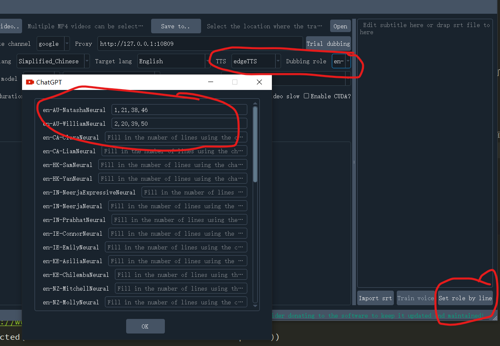

[简体中文](./README.md) / [👑 Donate buy me a coffee](https://ko-fi.com/jianchang512) / [Discord](https://discord.gg/TMCM2PfHzQ) / [Twitter](https://twitter.com/mortimer_wang)

# Video Translation and Dubbing Toolkit

>
> This is a video translation and dubbing tool that can translate a video in one language into another language with dubbing and subtitles.
>
> Voice recognition is based on the `faster-whisper` offline model.
>
> Text translation supports `google|baidu|tencent|chatGPT|Azure|Gemini|DeepL|DeepLX`.
>
> Text-to-speech synthesis supports `Microsoft Edge tts` `Openai TTS-1` `Elevenlabs TTS`
>


# Main Use Cases and How to Use

【Translate Video and Dub】Set each option as needed, freely configure combinations to achieve translation and dubbing, automatic speed increase or decrease, merging, etc

【Extract Subtitles Without Translation】Select video files, select the video source language, then recognize the text from the video and automatically export subtitle files to the target folder

【Extract Subtitles and Translate】Select a video file, select the video source language, set the desired translation target language, then recognize the text from the video and translate it into the target language, then export bilingual subtitle files to the target folder

【Subtitles and Video Merging】Select the video, then drag the existing subtitle file to the right subtitle area, set both the source and target languages to the language used in the subtitles, then select the dubbing type and role, and start execution

【Creating Dubbing for Subtitles】Drag local subtitle files to the right subtitle editor, then select the target language, dubbing type and role, the dubbed audio file will be generated in the target folder

【Text Recognition for Audio and Video】Drag the video or audio to the recognition window, it will recognize the text and export it in the form of srt subtitles

【Text to Speech Synthesis】Generate a dubbing for a piece of text or subtitle using a specified dubbing role

【Separate Audio from Video】Separate video files into audio files and silent videos

【Audio, Video, and Subtitle Merging】Merge audio files, video files, and subtitle files into one video file

【Audio and Video Format Conversion】Conversion between various formats
【Text and srt Translation】Text and srt Translation to other language


https://github.com/jianchang512/pyvideotrans/assets/3378335/e02cf259-95d1-4044-85ca-0bb70c808145


[Youtube demo](https://youtu.be/-S7jptiDdtc)


# Usage of Precompiled EXE Version

0. Only available for win10 win11 systems/Mac needs to compile from source code

1. [Click to download the latest version from release](https://github.com/jianchang512/pyvideotrans/releases), decompress, double click sp.exe


# Source Code Deployment

1. Set up the Python 3.9->3.11 environment.
2. `git clone https://github.com/jianchang512/pyvideotrans`
3. `cd pyvideotrans`
4. `python -m venv venv`
5. For Windows, run `%cd%/venv/scripts/activate`; for Linux and Mac, run `source ./venv/bin/activate`.
6. `pip install -r requirements.txt`, if version conflict error occurred, please executable `pip install -r requirements.txt --no-deps`
7. For Windows, unzip ffmpeg.zip to the root directory (ffmpeg.exe file); for Linux and Mac, Manually installing ffmpeg on your own
8. Open the software interface by running `python sp.py`.
9. If CUDA acceleration support is needed, the device must have an NVIDIA GPU. For specific installation steps, see [CUDA Acceleration Support](https://github.com/jianchang512/pyvideotrans?tab=readme-ov-file#cuda-%E5%8A%A0%E9%80%9F%E6%94%AF%E6%8C%81).


# Instructions for use

1. Original Video: Choose mp4/avi/mov/mkv/mpeg videos, you can select multiple videos;

2. Output Video Directory: If not selected, it will be generated in `_video_out` in the same directory by default, and two types of subtitle files in the source and target languages will be created in the srt folder in that directory

3. Select Translation: Google|Baidu|Tencent|ChatGPT|Azure|Gemini|DeepL|DeepLX translation channels can be selected

4. Network Proxy Address: If your region cannot directly access Google/ChatGPT, you need to set a proxy in the software interface network proxy. For example, if you use v2ray, fill in `http://127.0.0.1:10809`, if clash, fill in `http://127.0.0.1:7890`. If you have changed the default port or are using other proxy software, fill it in as needed

5. Video Original Language: Select the language type in the video to be translated

6. Translation Target Language: Select the language type you hope to translate into

7. Select Dubbing: After selecting the translation target language, you can select the dubbing role from the dubbing options;
   
   Hard Subtitles: Permanently display subtitles that cannot be hidden, if you want subtitles when playing on the web page, please choose hard subtitles embedded

   Soft Subtitles: If the player supports subtitle management, it can display or hide subtitles, this method will not display subtitles when playing on the web page, some domestic players may not support it, need to put the generated video and the same name srt file and video in one directory to display


8. Voice recognition model: Select base/small/medium/large/large-v3, the recognition effect is getting better and better, but the recognition speed is getting slower and slower, and more memory is needed, the first time will need to download the model, default base, can download the model separately in advance Put it in the `current software directory/models` directory.

   Whole recognition / pre-segmentation: whole recognition refers to directly sending the whole voice file to the model for processing, segmentation may be more accurate, but it may also make a single subtitle of 30s length, suitable for audio with clear silence; pre-segmentation refers to the audio in advance It is cut into about 10s length and then sent to the model for processing separately.

    [download models](https://github.com/jianchang512/stt/releases/tag/0.0)
    
    [VLC decoder download](https://www.videolan.org/vlc/)

    [FFmepg download (compiled version included)](https://www.ffmpeg.org/)

9. Dubbing speed: Fill in a number between -90 and +90, the same sentence under different language voices, the required time is different, so after dubbing, the sound and picture subtitles may be out of sync, you can adjust the language speed here, negative numbers represent Slow down, positive numbers represent accelerated playback.

10. Audio and video alignment: They are "dubbing automatic acceleration" and "video automatic slowdown"

> 
> The pronunciation duration in different languages after translation is different. For example, a sentence in Chinese is 3s, which may be 5s when translated into English, leading to inconsistent duration and video.
> 
> 2 solutions:
>
>     1. Forced dubbing to speed up and play, in order to shorten the dubbing duration and align with the video
> 
>     2. Forced video to play slowly, in order to prolong the video duration and align with the dubbing.
> 
> Only one of the two can be chosen
>  

  
11. Silent Segment: Fill in a number between 100 and 2000, in milliseconds, default is 500, that is, voice is divided into sections with silent segments of 500ms or more

12. **CUDA Acceleration**: Confirm that your computer's graphics card is an N card and that the CUDA environment and drivers have been properly configured, then turn on this option for greatly improved speed. For the specific configuration method, see below [CUDA Acceleration Support](https://github.com/jianchang512/pyvideotrans?tab=readme-ov-file#cuda-%E5%8A%A0%E9%80%9F%E6%94%AF%E6%8C%81)

13. TTS: Available in edgeTTS and openai TTS model, choose the role to synthesize the voice, openai needs to use the official interface or a third-party interface that has opened up the tts-1 model

14. Click the start button to display the current progress and log at the bottom, and the subtitle is displayed in the right text box

15. After the subtitle analysis is completed, it will pause and wait for the subtitle to be modified. If no operation is performed, it will automatically continue the next step after 60s. You can also edit the subtitle in the right subtitle area and then manually click to continue synthesis

16. In the subfolder of the software directory, find the srt folder with the same name as the video file to generate two files, the suffix is the original language and the target language text subtitle file.

17. Set line role：You can set the pronunciation role for each line in the subtitle. First, select the TTS type and role on the left, and then click "Set line role" in the lower right corner of the subtitle area. In the text after each character name, fill in the line number that you want to use for dubbing, as shown in the following figure:

    


# Frequently Asked Questions

1. Using Google Translation, error is prompted.

   Domestically, using Google or the official interface of chatGPT requires a VPN.

2. Have used global proxy, but it doesn't seem to be going through proxy.

   Need to set specific proxy address in software interface "network proxy", such as http://127.0.0.1:7890

3. Prompting that FFmpeg does not exist.

   First, make sure there are ffmpeg.exe and ffprobe.exe files in the root directory of the software. If not, unzip ffmpeg.7z and put these two files in the root directory of the software.

4. CUDA is enabled on Windows, but errors are prompted.

   A: Firstly, refer to the [detailed installation method](https://juejin.cn/post/7318704408727519270) and confirm that you have successfully installed the related cuda tools. If errors still exist, [click here to download cuBLAS](https://github.com/jianchang512/stt/releases/download/0.0/cuBLAS_win.7z). After unzipping it, copy the dll files to C:/Windows/System32.

   B: If you are sure it is not related to A, check if the video is H264 encoded mp4. Some HD videos are H265 encoded, which is not supported. You can try to convert to H264 video in the "Video Toolbox".

5. Prompting that the model does not exist.

   After version 0.985, the model needs to be reinstalled. The folder under models directory is the folder of each model, not just pt files.
To use the base model, ensure that the models/models--Systran--faster-whisper-base directory exists. If it does not, download it and copy this directory to models. Similarly for small, medium, and large-v3 models.

   [Complete model download link](https://github.com/jianchang512/stt/releases/tag/0.0)

6. Prompting the directory does not exist or permission error.

   Right-click on sp.exe and open with administrator permission.

7. Prompting error, but no detailed error message.

   Open logs directory, look for the latest log file, scroll to the bottom to see error messages.

8. The large-v3 model is very slow.

   If you do not have a GPU, or have not set up the CUDA environment properly, or your GPU memory is less than 4G, please do not use this model, otherwise it will be very slow and lagging.

9. Prompting missing cublasxx.dll file.

   Sometimes you may encounter an error saying "cublasxx.dll does not exist", then you need to download cuBLAS and copy the dll file to the system directory.

   [Click here to download cuBLAS](https://github.com/jianchang512/stt/releases/download/0.0/cuBLAS_win.7z). Extract it and copy the dll files to C:/Windows/System32.

10. Background music is lost.

   Only human voices are recognized and saved, so there will be no original background music in the dubbed audio. If you need to retain it, you can use the [voice-background music separation project](https://github.com/jianchang512/vocal-separate) to extract the background music, and then merge it with the dubbed file.

11. How to use custom voice.

   Currently, this feature is not supported. If needed, you can first recognize the subtitles, and then use another [voice cloning project](https://github.com/jiangchang512/clone-voice), enter the subtitle srt file, select the customized voice to synthesize the audio file, and then recreate the video.

13. Subtitle voice cannot be aligned.

> Duration of pronunciation in different languages may vary after translation. For example, a sentence in Chinese may take 3s, in English could take 5s, leading to inconsistency in duration with the video.
>
> There are two solutions:
>
>     1. Force dubbing playback speeding up to shorten the duration to align with the video.
>
>     2. Force video to play at a slower speed to extend the duration to align with the dubbing.
>
> Can only choose one of two.

14. Subtitles do not display or display gibberish.

>
> Using soft synthesized subtitles: Subtitles are embedded into the video as separate files and can be extracted again. If the player supports it, you can enable or disable subtitles in the player's subtitle management.
>
> Note that many domestic players must put the srt subtitle file in the same directory as the video file and have the same name in order to load soft subtitles. Also, you might need to convert the srt file to GBK encoding, otherwise, gibberish will be displayed.
>

15. How to switch the software interface language/Chinese or English.

If there is no set.ini file in the software directory, create one first, then paste the following code into it, fill in the language code after `lang=`, `zh` stands for Chinese, `en` stands for English, then restart the software

```
[GUI]
;GUI show language ,set en or zh  eg.  lang=en
lang =

```


# CLI Command Line Mode

[](https://colab.research.google.com/drive/1yDGPWRyXeZ1GWqkOpdJDv4nA_88HNm01?usp=sharing)

cli.py is a script executed from the command line and `python cli.py` is the simplest way to execute it.

Received parameters:

`-m absolute address of mp4 video`

The specific configuration parameters can be configured in cli.ini located in the same directory as cli.py. The address of other mp4 videos to be processed can also be configured by command line parameter `-m absolute address of mp4 video`, such as `python cli.py -m D:/1.mp4`.

The complete parameters are in cli.ini, the first parameter `source_mp4` represents the video to be processed. If the command line passes parameters through -m, the command line parameter will be used, otherwise, `source_mp4` will be used.

`-c configuration file address`

You can also copy cli.ini to another location and specify the configuration file to be used through `-c absolute path address of cli.ini` on the command line, such as `python cli.py -c E:/conf/cli.ini`, which will use the configuration information in this file and ignore the configuration file in the project directory.

`-cuda` does not need to follow the value, as long as it is added, it means to enable CUDA acceleration (if available) `python cli.py -cuda`

Example:`python cli.py -cuda -m D:/1.mp4`


## Specific parameters and explanations within cli.ini

```
;Command line parameters
;Absolute address of the video to be processed. Forward slash as a path separator, can also be passed after -m in command line parameters
source_mp4=
;Network proxy address, google chatGPT official China needs to be filled in
proxy=http://127.0.0.1:10809
;Output result file to directory
target_dir=
;Video speech language, select from here zh-cn zh-tw en fr de ja ko ru es th it pt vi ar tr
source_language=zh-cn
;Speech recognition language, no need to fill in
detect_language=
;Language to translate to zh-cn zh-tw en fr de ja ko ru es th it pt vi ar tr
target_language=en
;Language when embedding soft subtitles, no need to fill in
subtitle_language=
;true=Enable CUDA
cuda=false
;Role name, role names of openaiTTS "alloy,echo,fable,onyx,nova,shimmer", role names of edgeTTS can be found in the corresponding language roles in voice_list.json. Role names of elevenlabsTTS can be found in elevenlabs.json
voice_role=en-CA-ClaraNeural
; Dubbing acceleration value, must start with + or -, + means acceleration, - means deceleration, ends with %
voice_rate=+0%
;Optional edgetTTS openaiTTS elevenlabsTTS
tts_type=edgeTTS
;Silent segment, unit ms
voice_silence=500
;all=whole recognition, split=pre-split sound segment recognition
whisper_type=all
;Speech recognition model optional, base small medium large-v3
whisper_model=base
;Translation channel, optional google baidu chatGPT Azure Gemini tencent DeepL DeepLX
translate_type=google
;0=Do not embed subtitles, 1=Embed hard subtitles, 2=Embed soft subtitles
subtitle_type=1
;true=Automatic dubbing acceleration
voice_autorate=false
;true=Automatic video slowdown
video_autorate=false
;deepl translation interface address
deepl_authkey=asdgasg
;Interface address of own configured deeplx service
deeplx_address=http://127.0.0.1:1188
;Tencent translation id
tencent_SecretId=
;Tencent translation key
tencent_SecretKey=
;Baidu translation id
baidu_appid=
;Baidu translation key
baidu_miyue=
; key of elevenlabstts
elevenlabstts_key=
;chatgpt api, ending with /v1, third party interface address can be filled in
chatgpt_api=
;key of chatGPT
chatgpt_key=
;chatgpt model, optional gpt-3.5-turbo gpt-4
chatgpt_model=gpt-3.5-turbo
; Azure's api interface address
azure_api=
;key of Azure
azure_key=
; Azure model name, optional gpt-3.5-turbo gpt-4
azure_model=gpt-3.5-turbo
;key of google Gemini
gemini_key=

```

# CUDA Acceleration Support

**[Install CUDA Toolkit article](https://juejin.cn/post/7318704408727519270)**


If the installation is correct, the precompiled version can now be used with CUDA. If not, you need to reinstall.

after installed，executable `python testcuda.py`, if output all is True, its ok, else reinstall

if alert "not exists cublasxx.dll", [click to download cuBLAS](https://github.com/jianchang512/stt/releases/download/0.0/cuBLAS_win.7z)，extract and copy dll to C:/Windows/System32


# Software Preview Screenshots


# Comparison of Videos Before and After

[Demo original video and translated video](https://www.wonyes.org/demo.html)


# Acknowledgements

> Some open source projects this program relies on (part of)

1. ffmpeg
2. PyQt5
3. edge-tts
4. faster-whisper