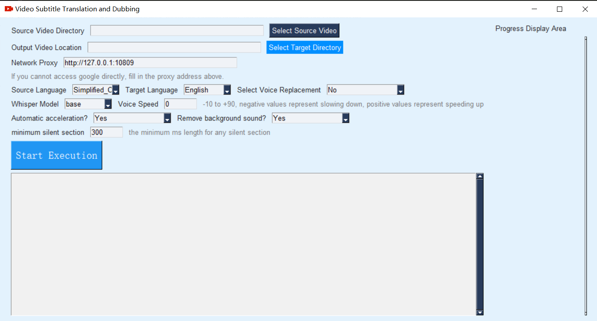
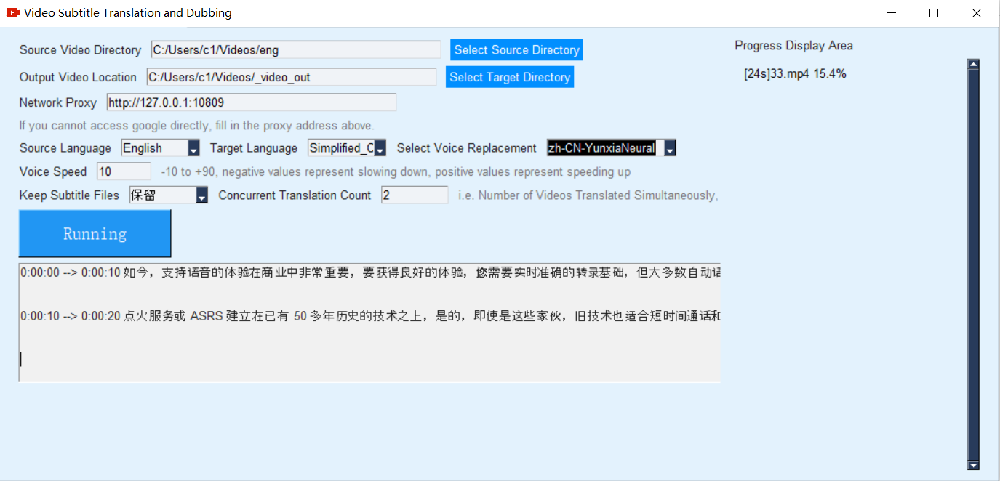

# [简体中文](./README_ENG.md)

This is a video translation tool that can translate a video from one language to another and create a dubbed video with the translated audio. The speech recognition is based on the openai-whisper offline model, text translation uses the Google Translate API, and text-to-speech synthesis uses Microsoft Edge TTS. Background music removal is done using Spleeter, and no purchase of any commercial API or payment is required.

# Instructions for using the precompiled version
0. Only available for Windows 10 and Windows 11 systems.
1. Download the latest version from the release, unzip it, and double-click on sp.exe.
2. Create a folder and place the mp4 video (mkv, avi, mpg) inside it. Select the folder from the "Original Video Directory" in the software interface. If you don't select the "Output Video Directory", it will be generated in the same directory with the name "_video_out" by default.
3. If you are unable to access Google directly in your region, you need to set up a proxy in the "Network Connection Proxy" in the software interface. For example, if you are using v2ray, fill in `http://127.0.0.1:10809`, if using clash, fill in `http://127.0.0.1:7890`. If you have modified the default port or are using other proxy software, fill in accordingly.
4. Depending on your computer performance, you can modify the "Concurrent Translation Quantity", which refers to the number of video tasks that are translated simultaneously.
5. "Dubbing Selection": After selecting the target language, you can choose the dubbing role from the dubbing options. "Remove Background Music": Select "Yes" to try removing the background music for more accurate results.
6. "Dubbing Speed": The time required for the same sentence in different language voices is different, so the dubbing may not be synchronized with the subtitles. You can adjust the speed here. Negative numbers represent slowing down, and positive numbers represent speeding up.
7. Click on "Start Execution". It will first check if it can connect to Google services. If it can, it will start the execution. The current progress will be displayed on the right, and detailed logs will be displayed in the white text box at the bottom.
8. It is recommended to use the mp4 format for better processing speed and network compatibility.
9. Use soft subtitle embedding: Subtitles are embedded as separate files in the video and can be extracted again. If supported by the player, you can enable or disable subtitles in the player's subtitle management.
10. By default, a subtitle file with the same name as the video will be generated in the "Original Video Directory" as "video_name.srt".
11. Unrecognized speech will be directly copied as the original speech.
12. If the background sound removal function is used, it will be time-consuming to download the model for the first time.
You can download this compressed package and unzip the files inside to [**dowload model**](https://github.com/jianchang512/pyvideotrans/releases/download/v0.3/2stems.zip)   pre trained_ Under the models/2stems directory

# Deployment and Modification of Source Code

1. Install Python 3.9+ on your computer.
2. `git clone https://github.com/jianchang512/pyvideotrans`
3. `cd pyvideotrans`
4. `pip install -r requirements.txt`
5. Unzip ffmpeg.zip into the root directory.
6. `python sp.py`
7. If the background sound removal function is used, it will be time-consuming to download the model for the first time.
You can download   [**dowload model**](https://github.com/jianchang512/pyvideotrans/releases/download/v0.3/2stems.zip)   this compressed package and unzip the files inside to  pre trained_ Under the models/2stems directory

# Software Preview Screenshots

# Original Video and Translated Video

[Original Video](https://www.wonyes.org/images/raw.mp4)

[Translated Video](https://www.wonyes.org/images/new.mp4)

# Possible Issues

> The translation uses requests to request Google API and then extracts it. If it is too frequent, it may be restricted.

# Acknowledgements

> This program relies on the following open-source projects:

1. pydub
2. ffmpeg
3. pysimpleGUI
4. googletrans
5. httpx
6. SpeechRecognition
7. edge-tts
8. Spleeter
9. openai-whisper